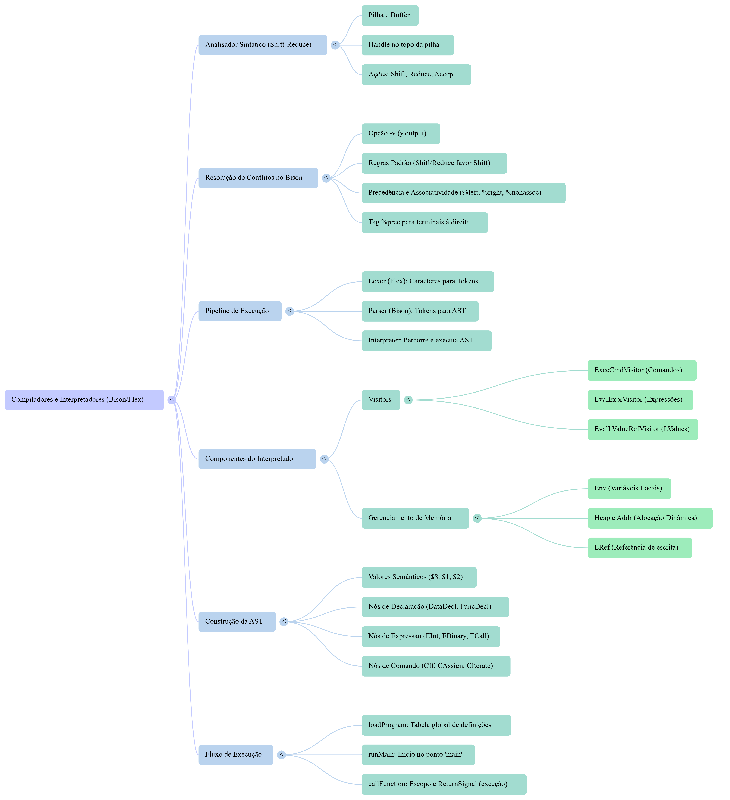

## Compilador da Linguagem lang2

**Disciplina:** Compiladores
**Ano/Semestre:** 2025/2
**Aluno:** Graziele de Cassia Rodrigues
**Matrícula:** 21.1.8120

## 📌 Descrição do Projeto

Este projeto implementa um compilador para a linguagem **lang2**, conforme especificação fornecida na disciplina de Compiladores.
A implementação contempla:

* Análise léxica (Flex)
* Análise sintática (Bison em C++)
* Definição completa da gramática da linguagem
* Interface de linha de comando conforme especificação

Os principais pontos a serem observados no projeto estão apresentados no fluxograma a seguir:



## 🛠️ Ferramentas Utilizadas

* **Flex** — geração do analisador léxico
* **Bison (C++)** — geração do analisador sintático
* **G++ (C++17)** — compilação do projeto
* **Make** — automação do processo de build

## ⚙️ Compilação

Para compilar o projeto, basta executar na raiz do diretório:

```bash
make
```

O comando irá gerar o executável:

```bash
./compiler
```

---

## ▶️ Execução

### Execução versao 

```bash
./compiler -v
```
### Execução análise sintática

```bash
./compiler -syn arquivo.lang2
```

### Execução interpretador

```bash
./compiler -i arquivo.lang2
```

### Execução testes automatizados
Foram desenvolvidos scripts em shell (.sh) para automatizar a execução dos testes do compilador, abrangendo sintaxe (casos corretos e incorretos) e interpretação.

Os scripts percorrem automaticamente os arquivos .lan dos diretórios de teste, executando o compilador com as opções correspondentes (-syn para validação sintática e -i para interpretação). Os resultados são avaliados por meio do código de saída do compilador.

Nos testes de interpretação, as saídas padrão e de erro são armazenadas em diretórios específicos, e os casos que falham são registrados em arquivos de log.
Já nos testes sintáticos, são verificados tanto a aceitação de programas válidos quanto a rejeição correta de programas inválidos.

Para usa-los basta conceder a permissão:

```bash
chmod +x testa_interpretacao.sh
chmod +x testa_sintaxe_certo.sh
chmod +x testa_sintaxe_errado.sh
```

E depois chamar o script desejado:

```bash
./testa_sintaxe_certo.sh
./testa_sintaxe_errado.sh
./testa_interpretacao.sh
```


